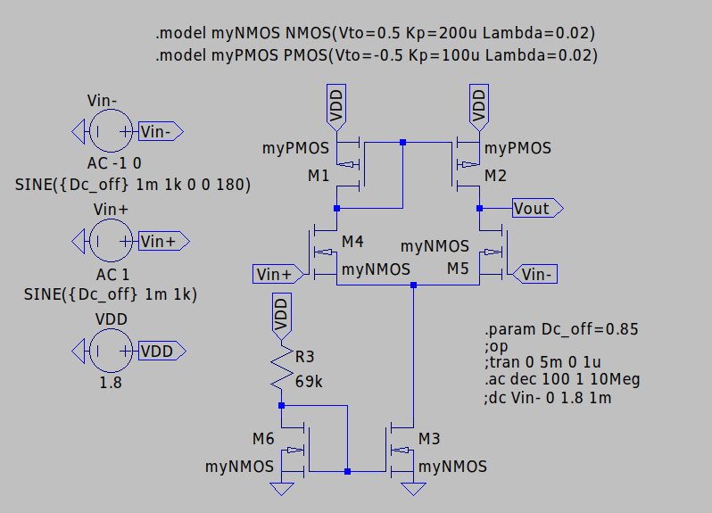
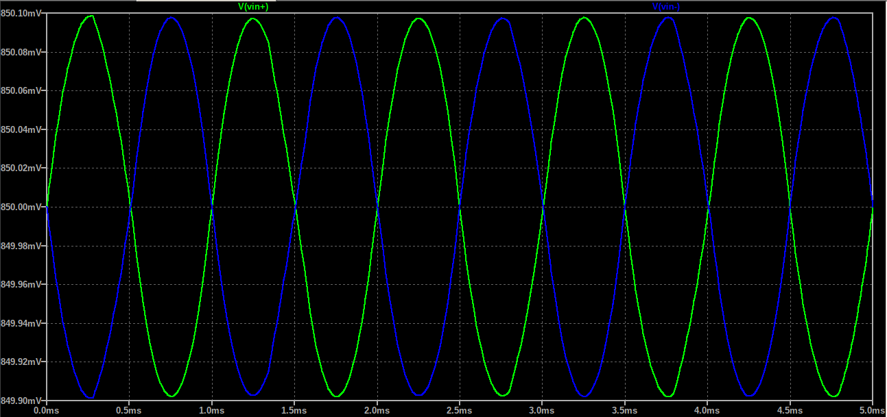
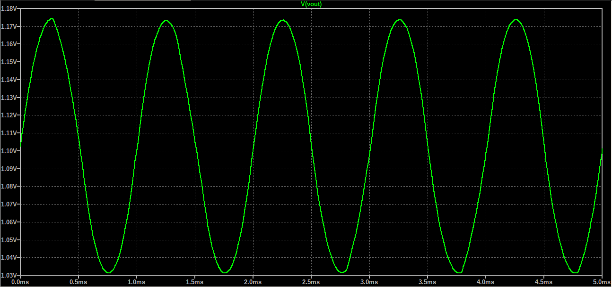
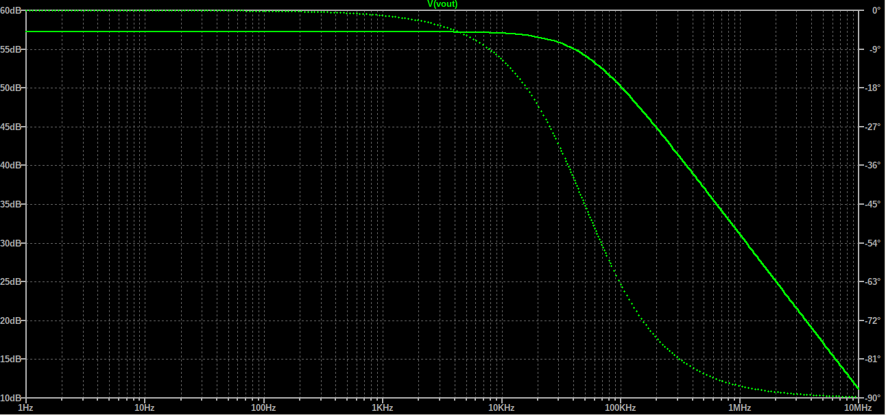

# 1.8V Non Inverting CMOS Differential Amplifier

A complete transistor-level CMOS Differential Amplifier design. The circuit receives a weak 1kHz sine with 100μV Amplitude, amplifies it with 57dB gain (70mV Amplitude). The input sources have a 0.85V offset, which provides enough voltage for the Tail NMOS to operate in saturation, but also avoid the clipping effect for 
bigger input signals. A NMOS Current Mirror provides the circuit with a 16μΑ current. A PMOS Current Mirror is used to convert the circuit to a single output Amplifier. The 2 PMOS are set to function with 8μA each.

All simulations and validations were performed in **LTspice**.

## Key Specifications

| Parameter | Value / Description |
| :--- | :--- |
| **Technology** | Generic NMOS Vth= 0.5V Kp=200u Lambda=0.02 (W/L) = (4u/1u)| 
                 | Generic PMOS Vth=-0.5V Kp=100u Lambda=0.02 (W/L) = (4u/1u)|
| **Supply Voltage (VDD)** | 1.8V |
| **Virtual Ground / DC Bias** | 0V |
| **Input Signal Amplitude** | 100μV |
| **Carrier Frequency** | 1kHz |
| **Current** | 16μΑ |
| **Reference Resistor** | 69kΩ |
| **Load Capacitor** | 1pF |
| **Bandwidth** | 0 - 52 kHz |
| **Midband Gain** | 57dB|

## Schematics & Simulation Results

### Schematic

### Transient Analysis
The system was evaluated with the use of a weak 100μV input signal to verify the circuit's gain.

### Input Signals

- **Blue Trace:** Input Vin- Signal
- **Green Trace:** Input Vin+ Signal

### Output Signal

- **Green Trace:** Amplified Output Signal

### AC Analysis

---
