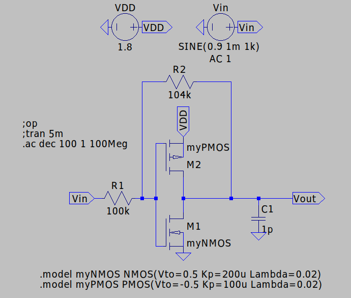
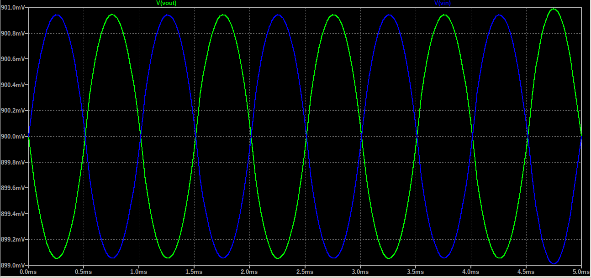
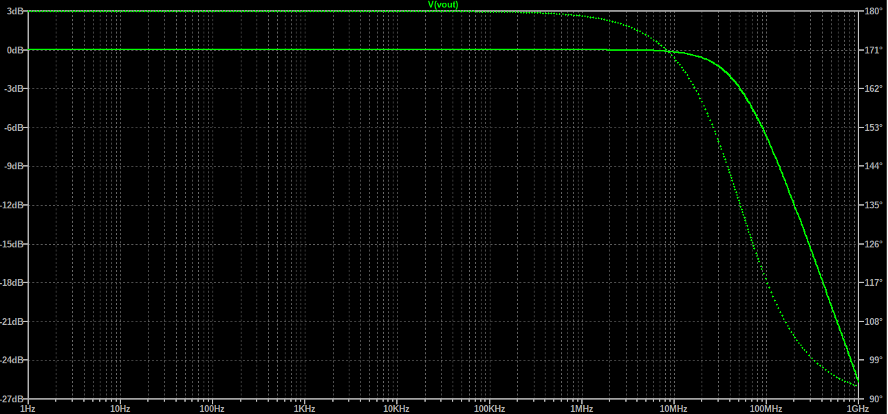

# 1.8V  Inverter

A complete transistor-level Inverter design. The circuit receives a 1kHz sine with 1mV Amplitude, inverts it with 0dB gain (1mV Amplitude). 2 Resistors were used
to bring the gain down to 0dB, by implementing a negative feedback. The 104k/100k pair provides the smallest gain.

All simulations and validations were performed in **LTspice**.

## Key Specifications

| Parameter | Value / Description |
| :--- | :--- |
| **Technology** | Generic NMOS Vth=0.5V Kp=200u Lambda=0.02 (W/L) = (4u/1u), Generic PMOS Vth=-0.5V Kp=100u Lambda=0.02 (W/L) = (8u/1u) |
| **Supply Voltage (VDD)** | 1.8V |
| **Virtual Ground / DC Bias** | 0V |
| **Input Signal Amplitude** | 1mV |
| **Carrier Frequency** | 1kHz |
| **Current** | 65μΑ |
| **Resistors** | 104kΩ, 100kΩ|
| **Load Capacitor** | 1pF |
| **Bandwidth** | 0 - 52 MHz |
| **Midband Gain** | 0dB|

## Schematics & Simulation Results

### Schematic

### Transient Analysis
The system was evaluated with the use of a weak 1mV input signal to verify the circuit's behaivor.

- **Blue Trace:** Input sine signal
- **Green Trace:** Output sine signal

### AC Analysis

---
