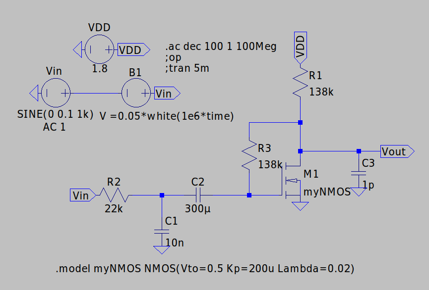
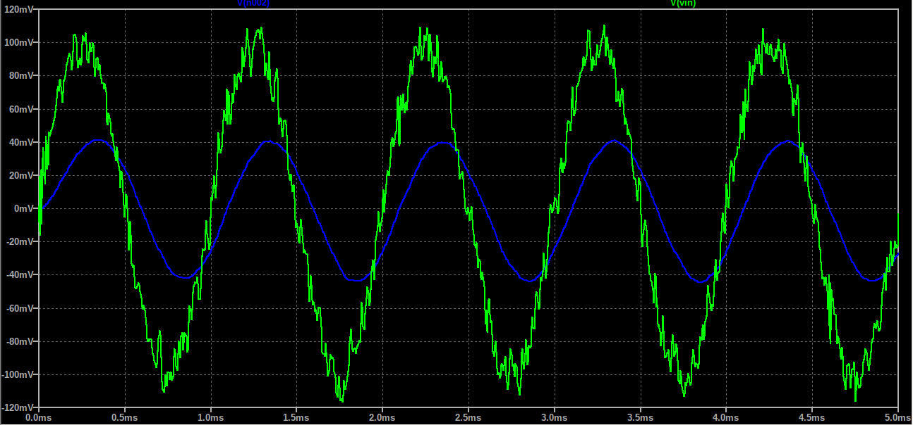
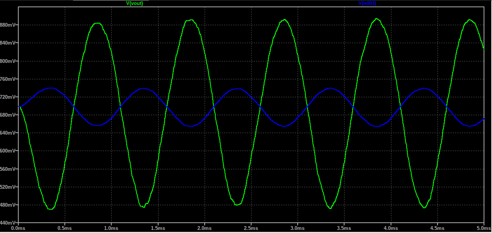
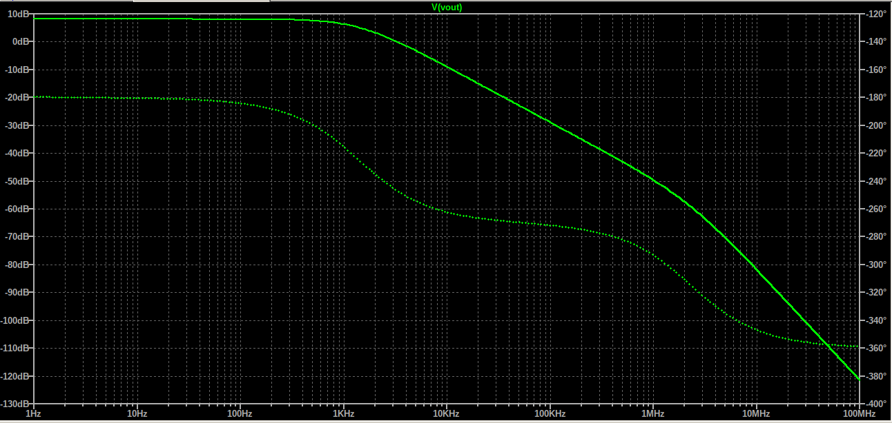

# 1.8V Simple NMOS Amplifier With Noise Filter

A complete transistor-level NMOS Amplifier design. The circuit receives a weak 1kHz sine with 10mV Amplitude with white noise. 
The circuit then filters the noise and amplifies the clean signal
by 8dB gain. The passband is lower than 1k, to filter the remove the noise to a greater extend.  

All simulations and validations were performed in **LTspice**.

## Key Specifications

| Parameter | Value / Description |
| :--- | :--- |
| **Technology** | Generic CMOS Vth=0.5V Kp=200u Lambda=0.02 (W/L) = (2u/1u) |
| **Supply Voltage (VDD)** | 1.8V |
| **Virtual Ground / DC Bias** | 0V |
| **Input Signal Amplitude** | 10mV |
| **Carrier Frequency** | 1kHz |
| **Drain Current** | 8μΑ |
| **NMOS Resistors** | 138kΩ |
| **Load Capacitor** | 1pF |
| **Bandwidth** | 0 - 1.4kHz |
| **Midband Gain** | 8dB|
| **Filter Resistor** | 22kΩ|
| **Filter Capacitor** | 10nF|
| **Passband** |0- 723 Hz |
| **DC Blocking Capacitor** | 300 μF|

## Schematics & Simulation Results

### Schematic

### Transient Analysis

The system was evaluated with the use of a weak 10mV input signal to verify the circuit's gain and a noise voltage source, which follows the equation "0.05*white(1e6*time)", to verify the circuit's lowpass filter.

### Noise Filter

- **Green Trace:** Input sine signal
- **Blue Trace:** Filtered output sine signal

### Amplifier Output

- **Green Trace:** Amplified sine signal
- **Blue Trace:** Input sine signal

### AC Analysis

---
