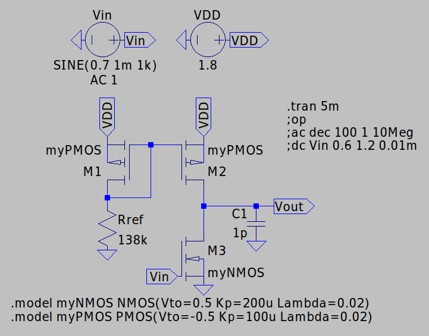
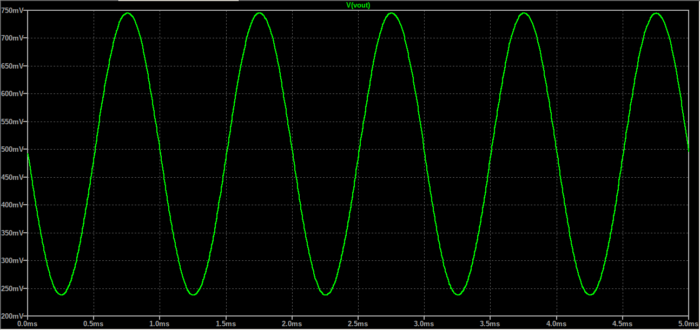
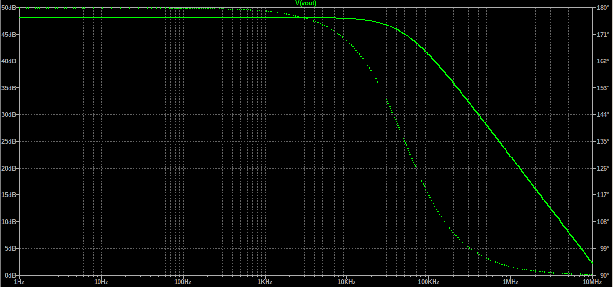

# 1.8V Inverting PMOS Current Mirror Amplifier

A complete transistor-level PMOS Current Mirror Amplifier design. The circuit receives a weak 1kHz sine with 1mV Amplitude, amplifies it with 48dB gain (250mV Amplitude). The input sources has a 0.7V offset, which provides enough voltage for the source NMOS to operate in saturation, but also avoid the clipping effect for 
bigger input signals. A PMOS Current Mirror provides the circuit with a 8μΑ current.

All simulations and validations were performed in **LTspice**.

## Key Specifications

| Parameter | Value / Description |
| :--- | :--- |
| **Technology** | Generic NMOS Vth= 0.5V Kp=200u Lambda=0.02 (W/L) = (2u/1u) Generic PMOS Vth=-0.5V Kp=100u Lambda=0.02 (W/L) = (4u/1u)|
| **Supply Voltage (VDD)** | 1.8V |
| **Virtual Ground / DC Bias** | 0V |
| **Input Signal Amplitude** | 1mV |
| **Carrier Frequency** | 1kHz |
| **Current** | 8μΑ |
| **Reference Resistor** | 138kΩ |
| **Load Capacitor** | 1pF |
| **Bandwidth** | 0 - 50 kHz |
| **Midband Gain** | 48dB|

## Schematics & Simulation Results

### Schematic

### Transient Analysis
The system was evaluated with the use of a weak 1mV input signal to verify the circuit's gain.

### Output Signal

- **Green Trace:** Amplified Output Signal

### AC Analysis

---
